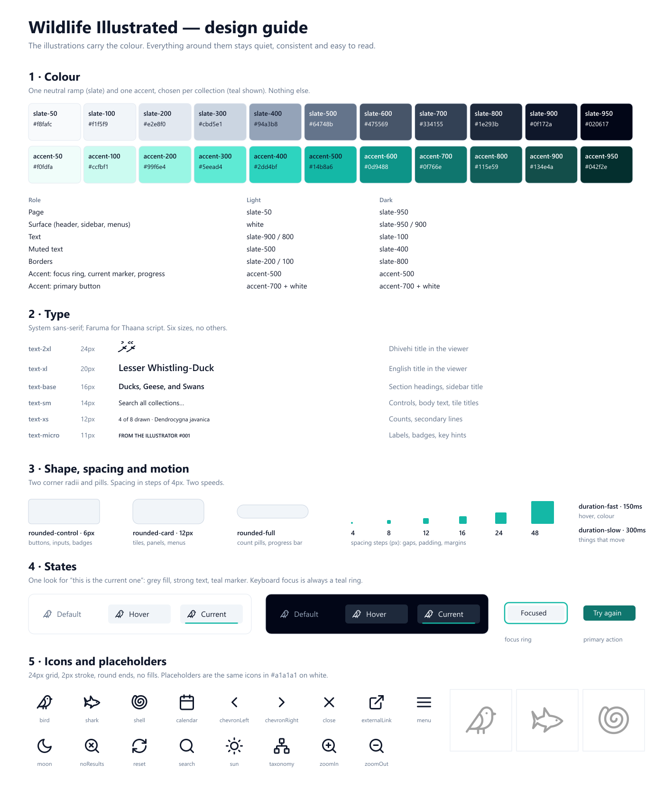
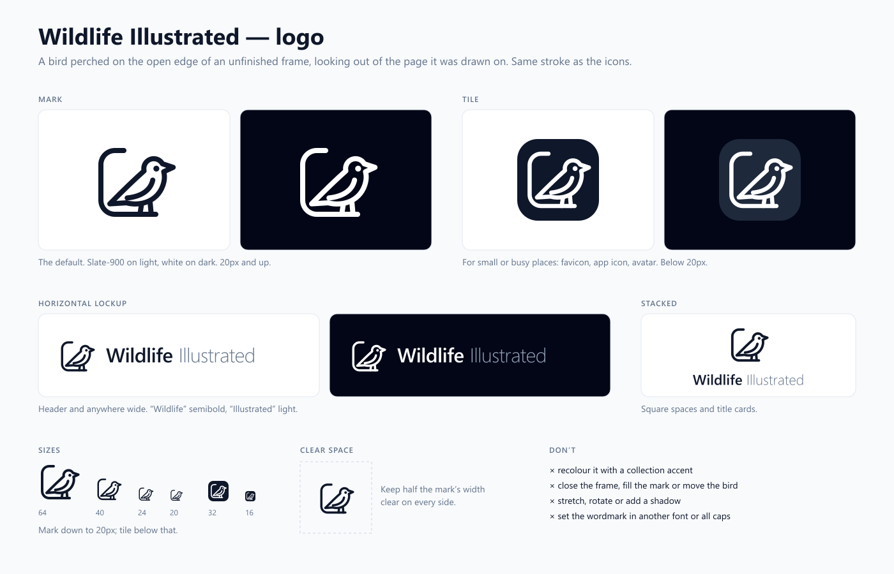

# Design guide

How Wildlife Illustrated looks, and the rules that keep it looking that way. Read this before adding
a button, a colour or an icon.

The picture is drawn from the real tokens and icons by `deno task design`. The tokens themselves
live in [`src/assets/main.css`](../src/assets/main.css); that file is the source of truth, and this
page explains how to use it.

## The one idea

**The illustrations carry the colour. Everything around them stays quiet.** The interface is grey
with a single teal accent, so a drawing is always the most colourful thing on the screen. When a
choice is unclear, pick the option that draws less attention to the interface.

## 1. Colour

Two ramps and nothing else: **slate** for every neutral, and **accent** for emphasis. Use the names
(`slate-500`, `accent-700`), never a hex value or a specific hue (`teal-500`) in a component.

**Each collection has its own accent,** so the colour also tells you where you are: birds are teal,
sharks blue, shells rose. A collection names its hue with `accent` in `public/collections.json`; the
menu of allowed hues is in `main.css`, and has more than are in use so a new collection can pick one
without touching the CSS:

| Hue     | White on 700 (button) | 500 on white (marker, ring) | Used by |
| ------- | --------------------- | --------------------------- | ------- |
| teal    | 5.5:1                 | 2.5:1                       | Birds   |
| emerald | 5.5:1                 | 2.5:1                       | free    |
| cyan    | 5.4:1                 | 2.4:1                       | free    |
| sky     | 5.9:1                 | 2.8:1                       | free    |
| blue    | 6.7:1                 | 3.7:1                       | Sharks  |
| indigo  | 7.9:1                 | 4.5:1                       | free    |
| violet  | 7.1:1                 | 4.2:1                       | free    |
| purple  | 7.0:1                 | 4.0:1                       | free    |
| fuchsia | 6.3:1                 | 3.5:1                       | free    |
| pink    | 6.0:1                 | 3.5:1                       | free    |
| rose    | 6.3:1                 | 3.7:1                       | Shells  |
| orange  | 5.2:1                 | 2.8:1                       | free    |

A hue is on the menu only if white text on its 700 shade is at least 4.5:1 **and** its 500 shade is
no paler against white than teal's (2.4:1 or more), because that shade draws the current marker and
the focus ring. A test checks every hue on the menu against both numbers. Amber, yellow, lime and
green are left out for being too pale at 500 (1.9 to 2.3:1); red is left out because it reads as an
error. Pick neighbours that are easy to tell apart: not rose and pink, or violet and purple, for two
collections that sit side by side.

| Role                                  | Light               | Dark                |
| ------------------------------------- | ------------------- | ------------------- |
| Page background                       | `slate-50`          | `slate-950`         |
| Surface (header, sidebar, menus)      | `white`             | `slate-950` / `900` |
| Text                                  | `slate-900` / `800` | `slate-100`         |
| Muted text (use `.text-muted`)        | `slate-500`         | `slate-400`         |
| Borders and dividers                  | `slate-200` / `100` | `slate-800`         |
| Focus ring, current marker, progress  | `accent-500`        | `accent-500`        |
| Primary button                        | `accent-700`, white | `accent-700`, white |
| On imagery and in the viewer (titles) | `white`             | `white`             |
| On imagery and in the viewer (body)   | `white/70`          | `white/70`          |
| On imagery and in the viewer (labels) | `white/50`          | `white/50`          |

Rules:

- **The accent is rare.** It marks keyboard focus, the current item, progress, a search match and
  the one primary button. If the accent appears in more than a few places on a screen, something is
  wrong.
- **Never use colour alone to say something.** The current tab has a fill and bolder text as well as
  a teal marker, so it still reads for someone who cannot tell teal from grey.
- **Check contrast for any new text colour.** Body text needs at least 4.5:1 against its background
  (WCAG AA); large text and icons need 3:1. The pairs in use measure:

  | Pair                                 | Ratio  |
  | ------------------------------------ | ------ |
  | `slate-900` on white                 | 17.9:1 |
  | `slate-500` on white (muted)         | 4.8:1  |
  | `slate-100` on `slate-950`           | 18.4:1 |
  | `slate-400` on `slate-950` (muted)   | 7.9:1  |
  | white on `accent-700` (button)       | 5.5:1  |
  | white at 70% on black (viewer body)  | 10.0:1 |
  | white at 50% on black (viewer label) | 5.3:1  |

  `accent-500` on white is only 2.5:1, so it is fine for a marker or ring but **not for text**; teal
  text on a light background must be `accent-700`. `slate-400` on white also fails for text.
- **Every colour has a dark-mode partner.** Write both (`text-slate-500 dark:text-slate-400`) or use
  a class that already does (`.text-muted`, `.btn-ghost`, `.nav-item`).

## 2. Type

The system sans-serif for everything, and **Faruma** (`.font-dhivehi`, with `dir="rtl"`) for Thaana
script. Six sizes; do not add another or write a pixel size by hand.

| Token        | Size | Used for                                       |
| ------------ | ---- | ---------------------------------------------- |
| `text-2xl`   | 24px | Dhivehi title in the viewer                    |
| `text-xl`    | 20px | English title in the viewer                    |
| `text-base`  | 16px | Section headings, sidebar title                |
| `text-sm`    | 14px | Controls, body text, tile titles               |
| `text-xs`    | 12px | Counts, secondary lines                        |
| `text-micro` | 11px | Labels (`.caps-label`), badges, keyboard hints |

Rules:

- **Weight shows importance, not size alone:** `font-semibold` for titles and headings,
  `font-medium` for controls, regular for everything else.
- **Numbers that change or line up** (counts, ids, zoom) get `tabular-nums` so they do not jiggle.
- **Scientific names are italic.** Ids are monospace (`IdBadge`).
- **Name order is fixed:** Dhivehi name first when there is one, then English, then scientific — on
  tiles and in the viewer. Search results lead with English, because that is what is typed.
- **Long names truncate** (`truncate`) instead of wrapping and pushing the layout around.

## 3. Wording

- **Counts** come from [`src/lib/formatCount.ts`](../src/lib/formatCount.ts): "15 of 204 drawn", "4
  of 8", "18 drawings", "1 result". Do not write a count by hand.
- **Sentence case** for buttons, labels and headings ("Clear search", not "Clear Search"). The small
  uppercase labels are styled that way by `.caps-label`; write them in sentence case in the markup.
- **Say what a control does** in its `aria-label` and tooltip ("Switch to dark mode"), especially
  for icon-only buttons.

## 4. Shape and spacing

- **Corners:** `rounded-control` (6px) for buttons, inputs and badges; `rounded-card` (12px) for
  tiles, panels and menus; `rounded-full` for count pills and the progress bar. Nothing else.
- **Spacing moves in steps of 4px** (Tailwind's `1` = 4px). The common values are `gap-1.5`/`gap-2`
  inside a control, `px-3 py-1.5` for a control's padding, `gap-3` to `gap-6` between tiles, and
  `p-4` (phone) or `p-6` for page padding. Related things sit closer together than unrelated things.
- **Borders before shadows.** Surfaces are separated by a 1px border. Shadows are for things that
  float above the page: menus, the open sidebar on a phone, a hovered tile.
- **Tiles are square** and images are never cropped (`object-contain`).

## 5. States

Every interactive thing needs all of these, and they look the same everywhere:

| State    | Look                                                                                 |
| -------- | ------------------------------------------------------------------------------------ |
| Default  | Muted text, no fill                                                                  |
| Hover    | Light grey fill, darker text                                                         |
| Current  | Grey fill, strong text, teal marker (`.nav-item` with `aria-current`/`aria-pressed`) |
| Focus    | 2px teal ring (`.focus-ring`), for keyboard users only                               |
| Disabled | Faded text, no hover, `cursor-not-allowed`                                           |

Rules:

- **Use the shared classes** instead of re-typing styles: `.btn-ghost` for an icon or text button,
  `.nav-item` for one choice among several, `.count-pill`, `.kbd-hint`, `.caps-label`.
- **"Current" is set with ARIA, not a class.** `.nav-item` styles itself from `aria-current` or
  `aria-pressed`, so what is shown and what a screen reader hears cannot disagree.
- **If it looks clickable, it must do something.** Undrawn tiles are not buttons, so they have no
  pointer cursor, hover lift or tab stop.
- **Never remove a focus ring** without replacing it.
- **Touch targets are at least 36px** on phones, with 8px between neighbours.

## 6. Motion

Two speeds: `duration-fast` (150ms) for hover and colour changes, `duration-slow` (300ms) for things
that move, such as the sidebar. Motion should explain a change, not decorate it. The site honours
the "reduce motion" system setting, which turns transitions and smooth scrolling off.

## 7. Logo

The logo is a bird perched on the open edge of an unfinished frame: a page corner with one side
missing, and the bird looking out of it. It is drawn with the same round 2px stroke as the icons, so
the logo and the interface share one hand, but the bird is the logo's own — an outline of a perching
bird (back, tail, breast, wing, legs), not the simpler `bird` icon used for the collection. The tile
is the same drawing reversed onto a solid square, not a second design. The source is
[`src/components/icons/logo.ts`](../src/components/icons/logo.ts); `<LogoMark />` draws it, and
`deno task design` writes the files in [`docs/logo/`](logo/).

| Version               | Use it for                                             | File                              |
| --------------------- | ------------------------------------------------------ | --------------------------------- |
| **Mark**              | The default, 20px and up                               | `logo/mark.svg`, `mark-white.svg` |
| **Tile**              | Small or busy places: favicon, app icon, avatar        | `logo/tile.svg`, `tile-512.png`   |
| **Horizontal lockup** | The header, and anywhere wide: mark, then the wordmark | built in the page                 |
| **Stacked**           | Square spaces and title cards                          | built in the page                 |

Rules:

- **Colour:** `slate-900` on light, white on dark. Never an accent colour: the accent changes with
  the collection, and the logo must not.
- **Wordmark:** "Wildlife" in semibold, "Illustrated" in light, in the system sans-serif, sentence
  case, with slightly tight letter-spacing. The second word is muted (`slate-500` / `slate-400`).
- **Size:** the mark down to 20px; below that use the tile, whose solid shape survives where the
  open frame would break up.
- **Clear space:** keep half the mark's width empty on every side.
- **Don't** close the frame, move the bird off its line, fill the mark, stretch or rotate it, add a
  shadow, or set the wordmark in another font or in capitals.

The browser-tab icon is still one of the drawings (`public/favicon.png`). To use the logo there
instead, replace it with `docs/logo/tile-512.png`.

## 8. Icons

Every icon lives in [`src/components/icons/icons.ts`](../src/components/icons/icons.ts) and is drawn
by `<Icon name="…" />`. The only other SVG in the project is the logo, in the same folder. See
[`icons.png`](icons.png).

The registry is grouped by purpose, and the file, the sheet and this guide all follow the same
order: **Collections** (bird, shark, shell), **Views** (taxonomy, calendar), **Search** (search,
noResults), **Navigation** (menu, chevrons, close, externalLink), **Viewer** (zoomIn, zoomOut,
reset), **Theme** (sun, moon), **Keyboard** (arrowsUpDown, enter) and **Brand** (github). A new icon
goes into one of the groups in `ICON_GROUPS`; a test fails if it is left out.

**Use an icon, not a Unicode symbol,** for arrows, the return key, ticks and crosses (↑ ↓ ↵ ✓ ✕).
Those characters come from whatever font the visitor has, so their size, weight and even shape
change from machine to machine. Plain words on a key cap ("esc", "Ctrl K") stay as text.

To add one, match the set:

- 24 × 24 grid, drawn to fill most of it; keep about 1.5px clear of the edge.
- 2px stroke, round ends and joins, **no fills** (a dot is a zero-length line: `M16 7h.01`).
- One or two bold shapes. If it needs more than about five strokes, simplify it.
- It must still read at 16px. Check with `deno task design` and look at `docs/icons.png`.
- **Brand marks are the exception.** Another organisation's logo (GitHub's, in the footer) is shown
  exactly as its owner publishes it, solid fill included, and marked `filled` in the registry. Do
  not redraw a brand mark in our line style: it is not ours to change, and most brands forbid it.
  Show it in one colour, next to the brand's name.
- Colour comes from the text colour (`currentColor`); size from `w-4 h-4` (16px) in controls or
  `w-5 h-5`/`w-6 h-6` for standalone use.
- An icon-only button always has an `aria-label`.

Collections name their icon in `public/collections.json` (`"icon": "bird"`).

## 9. Placeholders

An item that is not drawn yet shows its collection's icon, 512 × 512, drawn once per theme:

| Theme | File             | Background            | Icon                  |
| ----- | ---------------- | --------------------- | --------------------- |
| Light | `<id>.webp`      | white                 | `#a1a1a1`             |
| Dark  | `<id>-dark.webp` | `slate-900` (#0f172a) | `slate-600` (#475569) |

`deno task placeholders` draws both from the icon set, so they never need editing by hand, and the
contract test fails if either is missing. They are deliberately faint (about 2.5:1 against their
background in both themes): a placeholder should recede next to a real drawing.

## 10. Layout

- **Breakpoints:** phone below 640px (two-column grid, search on its own row), tablet from 768px
  (single-row header), desktop from 1024px (sidebar always visible).
- **Design the phone layout first,** then let it widen. Nothing may scroll sideways; check at 375px.
- **One job per region:** the header switches collection, view and theme; the sidebar jumps between
  sections; the grid shows drawings; the viewer shows one drawing and its details.

## Checklist for a UI change

1. Does it use only slate and accent, by name, with a dark-mode partner?
2. Is every size from the six-step type scale and the 4px spacing steps?
3. Are corners `rounded-control`, `rounded-card` or `rounded-full`?
4. Does it have hover, focus, current and disabled states, using the shared classes?
5. Does it work with the keyboard alone, and does every icon-only button have a label?
6. Does text meet 4.5:1 contrast in both themes?
7. Does it fit at 375px wide without sideways scrolling, with 36px touch targets?
8. Are counts worded by `formatCount.ts`, and labels in sentence case?
9. If you added an icon or changed a token, did you run `deno task design`?
